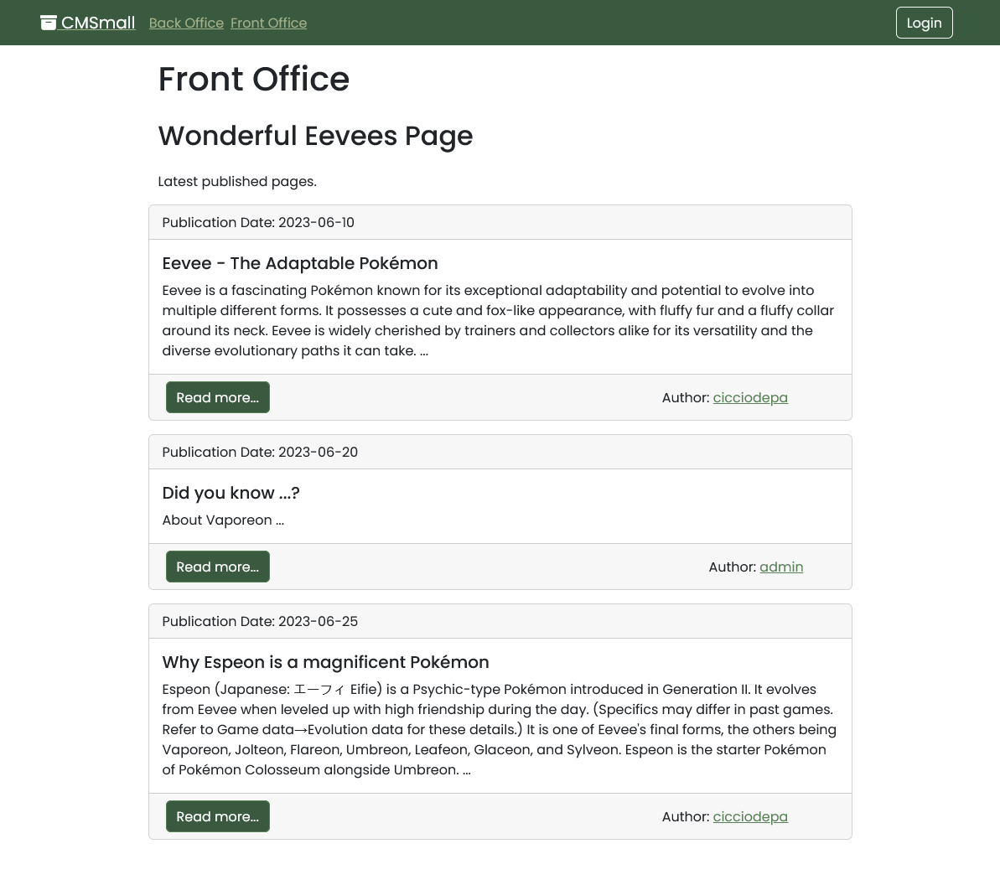
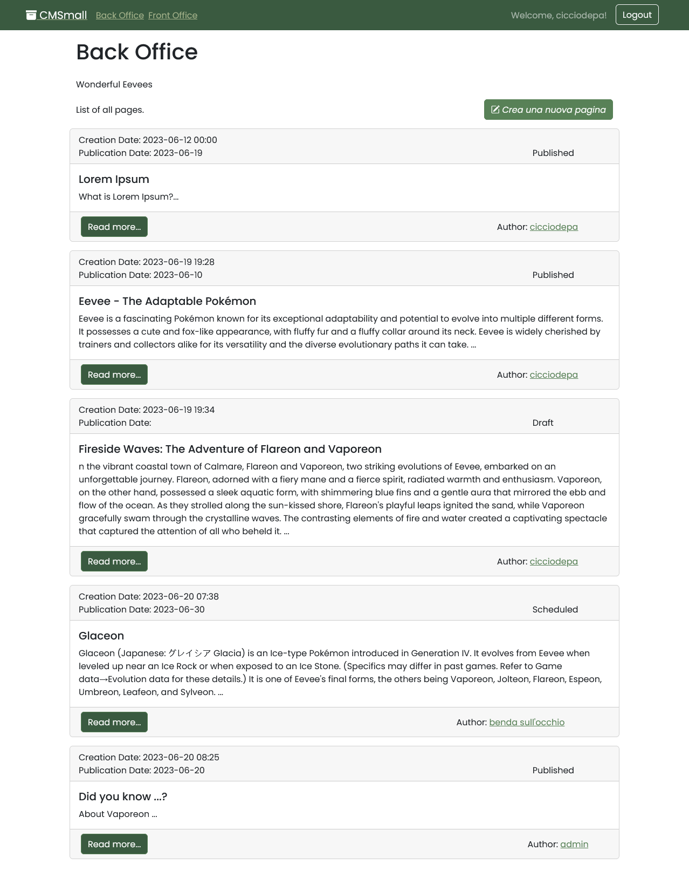
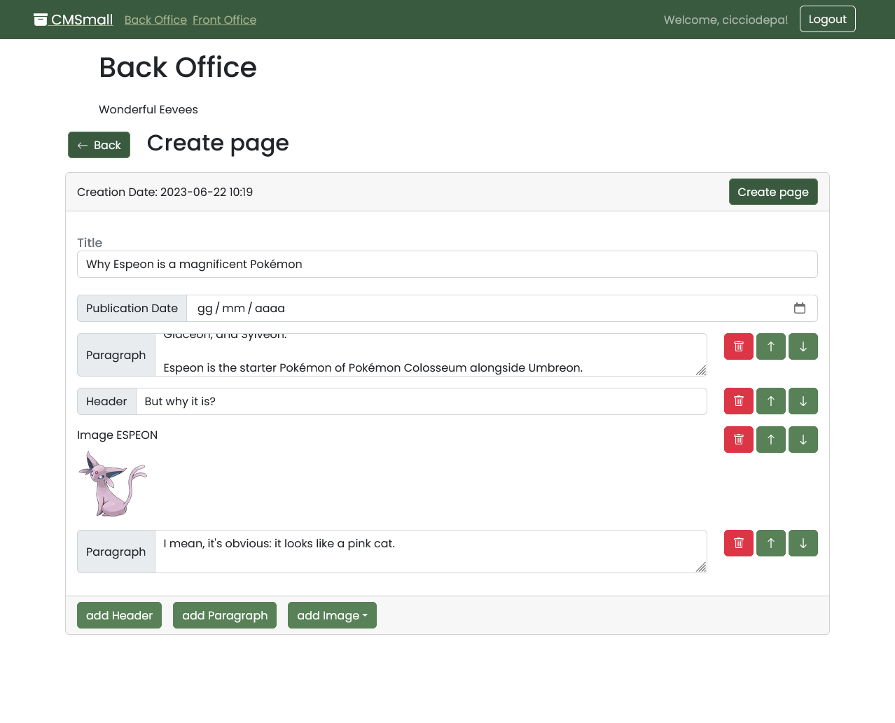
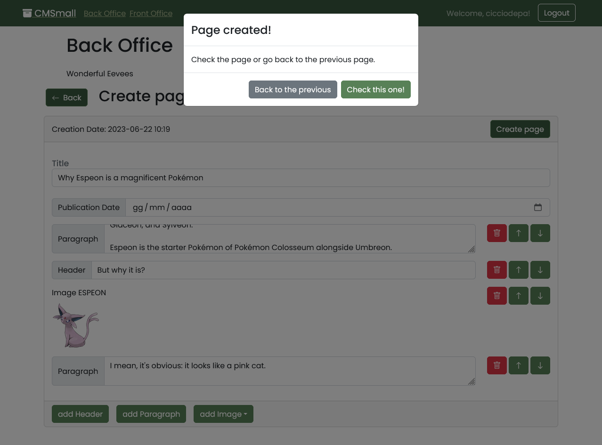

# Exam #26/06: "CMSmall"

## Student: s318048 DE PASCALE MARIO FRANCESCO 

# Server side

## API Server

- POST `/api/sessions`
  - request body with username and password
  - response body is made up of username, id, name, surname, role

- GET `/api/sessions/current`

- DELETE `/api/sessions/current`
  - delete current session 

- GET `/api/pages`
  - response body is a list of pages:
    - if authenticated, all pages
    - if not, only published pages

- POST `/api/pages`
  - request body: page 
  - response body: page (with id)

- PUT `/api/pages/:id` 
  - request param page id
  - response body: updated page if exists

- DELETE `/api/pages/:id` 
  - request param page id
  - response body: message about the operation

- GET `/api/users/uids`
  - needed for the admin to see all users for changing the authorship
  - response list of usernames and IDs

- POST `/api/site`
  - allows admin changing the website name in the app
  - request body: name
  - response body: name

- GET `/api/site`
  - response body: website name

## Database Tables

- Table `users` 
  - id
  - email 
  - firstname
  - lastname
  - password
  - salt
  - role

- Table `pages` 
  - title
  - author
  - creationdate
  - publicationdate

- Table `blocks`
  - id
  - type (1 header, 2 par, 3 img)
  - content (se img, il content è name: "name.jpg", url: "url-foto.jpg")
  - position 
  - pageid

- Table `website`
  - id
  - name (name of the website setted by the admin)

# Client side

## React Client Application Routes

- Route `/`: homepage
- Route `/backoffice` : shows all (logged) pages
- Route `/backoffice/edit`: create or editing of a page
- Route `/backoffice/page`: full screen page view
- Route `/frontoffice`: shows all published pages (non logged)
- Route `/frontoffice/page`: as bo page
- Route `/login`: allows to login

## Main React Components
- `Auth`: provides LoginForm and LoginButton
- `AlertError`: provides a presetted Alert for other components
- `Buttons`: provides several buttons
- `Images`: provides images and a selector of those
- `Modals`: provides presetted templates of modals 
- `Navigation`: navbar
- `PageCard`: base component for the renderization of a single page in list
- `PageCardList`: makes the list of pages
- `PageCardExpanded`: shows full screen page, with editing buttons (if allowed)
- `PageCardForm`: form for page creation/editing
- `PageLayour`: provides layout for visualization

# Usage info

## Example Screenshot

## Users Credentials

- mariodepa@polito.it, password (USER with publication)
- pepibra@polito.it, password (USER with no publication)
- kaneki@tghoul.com, haisesasaki (USER with publication)
- admin@system.com, password (ADMIN)
